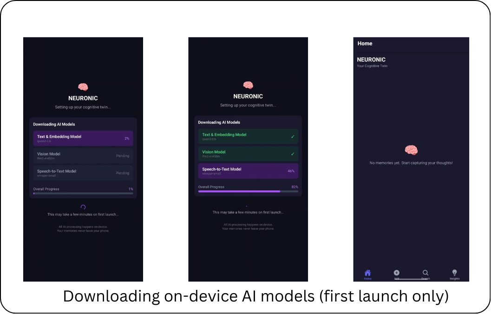
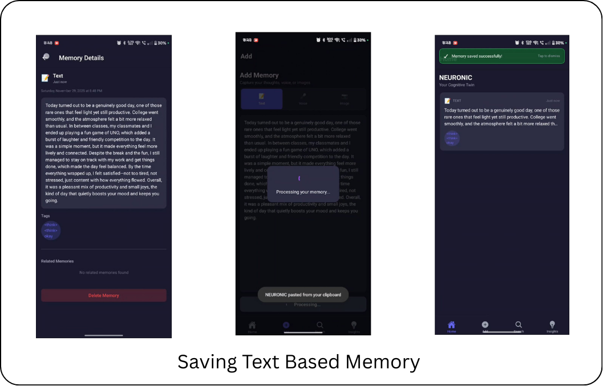
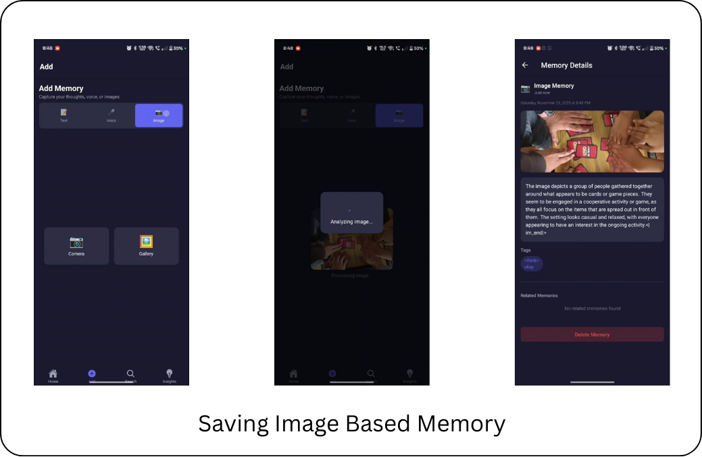
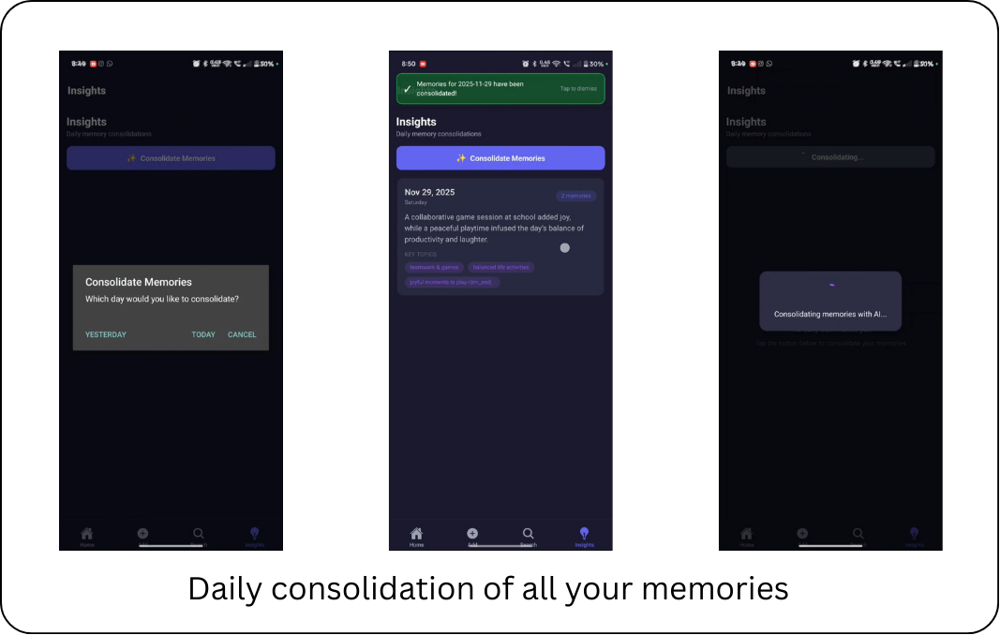
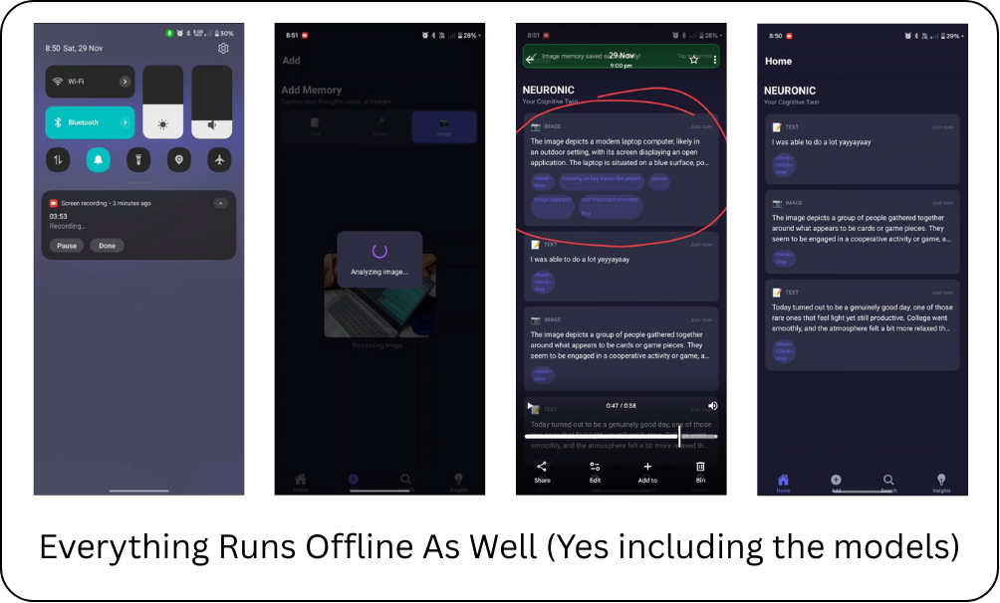

<a href="https://reactnative.dev"></a>
   <a href="https://expo.dev"></a>
   <a href="#tech-stack"></a>
   
   
   
   

<p align="center">
   
</p>

   

# Neuronic

Neuronic is a local-first Cognitive Twin for your mobile device. It runs entirely on-device to capture, organize, search, and consolidate your thoughts without sending any data to the cloud. Neuronic turns your phone into a private "second brain" powered by efficient local LLMs, embeddings, and vision models.

## Key Principles

- Privacy by design: no accounts, no servers, no cloud processing by default.
- Instant intelligence: on-device inference for low latency and offline use.
- Unified memory: text, voice, and images transformed into a searchable, connected memory graph.
- Daily consolidation: automatic summarization that converts raw inputs into structured long-term insights.

## Core Features

- Text, voice, and image capture with local processing
- Semantic embeddings and similarity search (SQLite-based)
- Personal knowledge graph: tags, links, and related memories
- Daily memory consolidation into compact summaries
- Fully offline operation, with optional hybrid expansion via a user-provided key

## How It Works

When you add a memory (text, voice, or image), Neuronic processes it on-device:


1. Text Memory
   - A lightweight local LLM extracts key ideas and tags.
   - The content is embedded into a vector representation.

2. Voice Memory
   - Audio is transcribed locally (e.g., Whisper small).
   - Transcription is embedded for search and linking.

3. Image Memory
   - A small vision model generates labels and concepts.
   - Image-derived text/tags are embedded for semantic search.


Each memory is stored as:

- Raw content
- Timestamp
- Embedding vector
- Semantic tags
- Links to similar memories

This forms a local personal knowledge graph backed by SQLite.

## Semantic Search

Neuronic uses vector similarity rather than keywords. Example queries:

- "Show me the business ideas I had last week."
- "What were my thoughts about starting a hardware project?"
- "Find memories related to productivity."

Embeddings are stored in SQLite; search runs on-device for instant results and complete privacy.

## Daily Memory Consolidation

Inspired by cognitive consolidation, Neuronic runs a daily background process:

- Groups the day's memories by theme
- Summarizes them into a compact packet
- Updates long-term knowledge entries

The result is structured insights and durable patterns across your timeline.


## Privacy Model

- Default: no data leaves the device
- No accounts required
- No server dependency
- All intelligence happens locally
- Optional: user-triggered expansion via hybrid key for cloud-assisted processing


## Tech Stack

- React Native + Expo (Android-focused)
- Cactus SDK (on-device LLMs, embeddings, vision)
- SQLite (local vector storage)
- Whisper small (offline voice transcription)

## Repository Structure

The application source is under `Code(react-native)/`. Key directories:

- `app/`: Navigation layouts, tabs, and screens
- `components/`: UI components (cards, recorder, picker, lists)
- `constants/`: Shared constants
- `db/`: SQLite setup, schema, and operations
- `services/`: App logic for cactus, consolidation, memory, relation, search
- `store/`: App state management
- `types/`: Shared type definitions
- `utils/`: Date utilities, error handling, similarity functions
- `android/`: Android project configurations (Gradle, build scripts)

Supporting configs:

- `package.json`, `tsconfig.json`, `tailwind.config.js`, `babel.config.js`, `metro.config.js`, `eas.json`, `app.json`

## Data Model (Conceptual)

A memory entry typically includes:

- `id`: unique identifier
- `kind`: `text` | `voice` | `image`
- `raw`: original content (text or URI)
- `transcript`: for voice/image-derived text when applicable
- `tags`: semantic tags
- `embedding`: vector for similarity
- `createdAt`: timestamp
- `links`: related memory ids

Storage is implemented with SQLite, with tables for memories, embeddings, tags, and relations.

## Intelligence Pipeline

- Ingestion: user creates a memory via text, voice, or image.
- Processing: local LLM/vision/transcription extract concepts; create embeddings.
- Storage: raw content + metadata + embeddings in SQLite.
- Retrieval: semantic search over embeddings; fetch related memories.
- Consolidation: daily summarization into long-term entries.

## Getting Started

Prerequisites:

- Node.js LTS
- Yarn or npm
- Android SDK and an emulator or a device
- Expo CLI

Install dependencies and run development server from `Code(react-native)`:

```powershell
# From repository root
cd "Code(react-native)"

# Install dependencies
npm install
# or
yarn install

# Start Expo
npx expo start --android
```

If the project uses EAS for builds:

```powershell
# Configure EAS (requires login)
# npx eas login
npx eas build -p android
```

## Environment & Configuration

- Tailwind setup via `tailwind.config.js` and `nativewind-env.d.ts`
- App configuration via `app.json` and `eas.json`
- Metro bundler config in `metro.config.js`

## Development Notes

- Core flows are in `app/(tabs)` and feature screens under `app/`
- Memory operations and schema are under `db/`
- Intelligence services (embedding, consolidation, search) are under `services/`
- UI components (e.g., `MemoryCard`, `SearchBar`, `VoiceRecorder`, `ImagePicker`) are under `components/`

## Testing & Verification

- Verify local inference by adding a text memory and checking related memories.
- Verify voice transcription by recording a short audio in `VoiceRecorder`.
- Verify image processing by adding a photo via `ImagePicker`.
- Run semantic search in the Search tab and confirm relevant results.
- Check daily consolidation output in the Insights tab.

## Troubleshooting

- Android build issues: check Gradle `android/app/build.gradle` and ensure SDK versions match your environment.
- Metro cache: clear with `npx react-native start --reset-cache`.
- Permissions: ensure microphone, camera, and storage permissions are granted.
- SQLite: verify that the database initializes correctly; inspect `db/schema.ts` and `db/operations.ts`.
- Cactus SDK/Whisper models: confirm local model assets are present or downloaded via `ModelDownloadScreen`.

## Roadmap

- Enhanced consolidation using topic modeling and temporal decay
- Cross-modal linking improvements (voice ↔ image ↔ text)
- On-device fine-tuning of user-specific embeddings
- Optional encrypted export/import of the local memory graph


### Add Memory

Code: `app/(tabs)/add.tsx`, components: `components/VoiceRecorder.tsx`, `components/ImagePicker.tsx`

- Text: Type a thought and save. The app extracts key ideas and tags locally and creates an embedding.
- Voice: Record using `VoiceRecorder`. Audio is transcribed on-device (e.g., Whisper small) and embedded.
- Image: Pick or capture using `ImagePicker`. A small vision model generates labels/concepts and produces embeddings.
- Result: Each saved item becomes a memory with timestamp, tags, and a vector representation in SQLite.

### Search Memories

Code: `app/(tabs)/search.tsx`, components: `components/SearchBar.tsx`, `components/MemoryList.tsx`

- Enter a natural-language query (no need for exact keywords).
- The query is embedded and matched against memory embeddings via vector similarity.
- Example queries:
   - Show me the business ideas I had last week
   - What were my thoughts about starting a hardware project?
   - Find memories related to productivity

### All Memories (Timeline)

Code: `app/(tabs)/index.tsx`, components: `components/MemoryList.tsx`, `components/MemoryCard.tsx`

- Displays a chronological feed of memories with quick context.
- Tap a memory to view details and navigate to related memories.
- Related items are surfaced using embedding similarity (see `components/RelatedMemories.tsx`).

### Insights (Daily Summaries)

Code: `app/(tabs)/insights.tsx`, services: `services/consolidation.ts`, components: `components/ConsolidationCard.tsx`

- Once per day, the consolidation service groups new memories by theme and produces a compact summary packet.
- The Insights tab shows daily summaries, patterns, and recurring topics.
- Depending on configuration, it may also expose a manual trigger for consolidation.

### Model Downloads

Component: `components/ModelDownloadScreen.tsx`

- Handles downloading or verifying local model assets (LLM, embeddings, transcription, vision) used by the app.
- Use this screen if models are missing or you need to update them.

Reference them here once added:


## License

Proprietary. All rights reserved by the repository owner unless otherwise stated.
